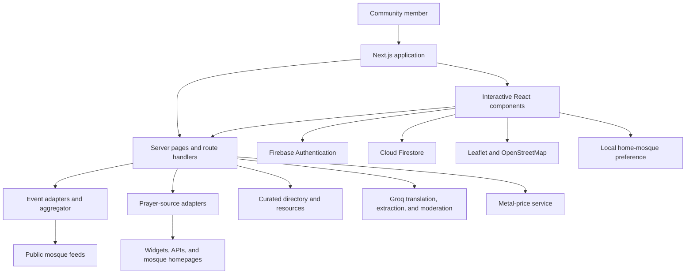

# Ummah Hub

**Your Muslim community, all in one place.**

Ummah Hub brings local mosque events, prayer schedules, community resources, and conversations into one accessible web application. Built for the **Hack Darul Islah 2026** hackathon, the project focuses on **Teaneck, New Jersey, and neighboring communities**, helping people discover what is happening nearby and stay connected beyond their own mosque.

Instead of checking individual mosque websites, scrolling through social media, and searching group chats, community members can start with one hub: find an upcoming program, check their home mosque's prayer times, explore local services, and ask the community a question.

**Repository:** [Abdurahim0202/umma-hub](https://github.com/Abdurahim0202/umma-hub)  
**Project stage:** Functional hackathon prototype  
**Local demo:** [http://localhost:3000](http://localhost:3000)

**Live Application:** [https://umma-hub.vercel.app/](https://umma-hub.vercel.app/)

## Contents

- [The problem](#the-problem)
- [Our solution](#our-solution)
- [Features](#features)
- [How AI is used](#how-ai-is-used)
- [Data sources and coverage](#data-sources-and-coverage)
- [Technology stack](#technology-stack)
- [Architecture](#architecture)
- [Run locally](#run-locally)
- [Project structure](#project-structure)
- [API routes](#api-routes)
- [Hackathon demo walkthrough](#hackathon-demo-walkthrough)
- [Design decisions and engineering challenges](#design-decisions-and-engineering-challenges)
- [Current limitations](#current-limitations)
- [Future development](#future-development)
- [Contributing and credits](#contributing-and-credits)

## The problem

Local Muslim communities have valuable programs and services, but the information is spread across separate websites, calendars, social posts, and private conversations. This creates practical barriers:

- Families can miss classes, youth programs, and community gatherings because they do not follow every organization.
- New residents may struggle to find nearby mosques, prayer schedules, or relevant support services.
- People looking for recommendations and help often depend on knowing the right group chat.
- Organizations publish information in different formats and languages, making discovery across mosques difficult.

Ummah Hub is built around a simple question: **How can someone find and participate in their local Muslim community from one starting point?**

## Our solution

The application combines a local discovery experience with practical daily tools and a community discussion space. It aggregates available public event feeds, presents mosque-specific prayer information, organizes source-linked resources, and lets authenticated members participate in conversations.

The initial scope is deliberately local: nine mosques and Islamic centers around Teaneck. This makes the prototype useful in a concrete community while providing a foundation for expanding to additional regions.

## Features

### A community dashboard

The home page brings together today's events, upcoming programs, local mosques, recurring activities, and community discussions. Quick links lead to events, classes, announcements, the mosque directory, and the Zakat calculator.

### A shared events calendar

- Imports upcoming events from Darul Islah and the Islamic Center of Passaic County.
- Combines different feed formats into a shared event model.
- Removes duplicates using organization, title, and date.
- Groups upcoming events by date and supports category filtering.
- Retains source links so visitors can review the original announcement.
- Uses server-side fetching and hourly revalidation for event-backed pages.

### Mosque discovery and maps

Browse a curated directory of nine local mosques and Islamic centers, with addresses, contact information, website links, directions, and program tags. The Explore page combines an interactive Leaflet map with local discovery content.

The map uses OpenStreetMap tiles. Directory records are curated in the repository; the current directory and Explore pages do not depend on Google Places.

### Mosque-specific prayer schedules

Select a home mosque to personalize the persistent prayer bar. The selection is shared across the interface and saved in browser local storage, including for visitors who are not signed in.

The prayer system retrieves available adhan, iqamah, and Jumu'ah information from mosque-specific sources. It prioritizes structured widgets and APIs, with AI-assisted extraction for selected sites without a structured integration. The header requests only the selected mosque's schedule, while the broader prayer views can retrieve schedules across the directory.

### Community discussions

Firebase-backed community features include:

- Email and password registration and sign-in.
- Creating categorized posts.
- Reading discussions and adding comments.
- Upvoting and downvoting posts.
- Browsing discussions with hot, new, and top sorting options.
- Profiles with display names, city, and interests.
- A moderation check for new posts and comments.

Public discussion content can be read without signing in. Participation uses Firebase authentication and Firestore access rules.

### Resources and announcements

The Resources page organizes curated programs and services published by local mosques, including education, Quran study, youth activities, scholarships, and community support. Entries link to their source pages.

The home page also identifies recurring programs from imported events. Announcements combine qualifying descriptions from upcoming event feeds with a small curated set of ongoing notices.

### Search across the community

The Search page matches text across upcoming events, mosques, resources, and loaded community posts. It provides one place to begin looking for a class, organization, service, or discussion.

### Zakat calculator

The calculator accepts asset values and liabilities, offers gold or silver Nisab selection, and displays an estimated amount based on the calculation implemented in the app. It retrieves metal prices from an external service and supports manual price entry when that service is unavailable.

Inputs are held in client component state rather than saved to a financial profile. The interface includes guidance to consult a qualified scholar for individual circumstances.

### Responsive navigation

Desktop navigation and a mobile bottom navigation component provide access to the app's main sections. Shared cards, spacing, typography, and an emerald color palette keep the experience consistent across pages.

## How AI is used

Ummah Hub uses the Groq API with the model identifier `openai/gpt-oss-20b` in three focused workflows:

| Workflow | Implementation | Fallback behavior |
| --- | --- | --- |
| Event translation | Detects Arabic-script text in event titles and descriptions and translates it into English. Repeated strings are translated once per aggregation run. | Preserves original text if the key is absent or the request fails. |
| Community moderation | Applies a local blocked-term check, then asks the model to classify remaining text for harmful language and harassment. | The AI layer fails open; local checks remain active. |
| Prayer-time extraction | Extracts explicitly published times from selected mosque homepages when no structured source is configured. | Returns unavailable data when extraction cannot produce a usable result. |

AI supports specific information-processing tasks. Structured prayer sources remain the preferred input, and automated extraction and translation still require validation against the original source.

## Data sources and coverage

| Area | Current source | Coverage notes |
| --- | --- | --- |
| Mosque directory | `lib/data/mosques.ts` | Nine curated local organizations. |
| Darul Islah events | [Public iCalendar feed](https://www.darulislah.org/events/?ical=1) | Imported and normalized on the server. |
| ICPC events | [Public events feed](https://icpcnj.org/events/feed/) | RSS and event metadata are normalized into the shared model. |
| Other mosque event feeds | Seven explicit stub adapters | Return `no_source`; directory inclusion does not imply live event coverage. |
| Prayer schedules | Darul Islah widget, Masjidal API, MOHID widgets, selected homepage extraction | Availability varies by mosque and source response. |
| Resources | `lib/data/resources.ts` | Curated, source-linked entries; changes require maintenance. |
| Announcements | Event descriptions and `lib/data/announcements.ts` | A combination of derived and curated content. |
| Discussions and profiles | Cloud Firestore | User-generated content and member profile data. |
| Map tiles | OpenStreetMap | Rendered with Leaflet and React Leaflet. |
| Metal prices | `api.gold-api.com` | Hourly fetch revalidation, with manual-entry fallback in the calculator. |

The import report endpoint exposes source status and event counts for troubleshooting. Empty results can indicate no upcoming events, unavailable sources, or failed requests; they do not establish that a mosque has no activities.

## Technology stack

Versions below reflect the repository's declared dependencies.

| Layer | Technology |
| --- | --- |
| Application framework | Next.js 16.3.4, App Router |
| User interface | React 19.2.8, TypeScript 5 |
| Styling | Tailwind CSS 4, CSS variables, utility helpers |
| UI primitives and icons | Radix UI packages, Lucide React |
| Authentication | Firebase Authentication, email/password |
| Database | Cloud Firestore through Firebase JS SDK 12.18.0 |
| Maps | Leaflet 1.9.4, React Leaflet 5.0.0, OpenStreetMap |
| AI integration | Groq chat-completions API |
| Dates | date-fns 4.4.0 and timezone utilities |
| Code quality | ESLint 9 and TypeScript |

The repository contains older Supabase files and migrations, but Firebase is the active authentication and community-data backend. Supabase setup is not required for the current application.

## Architecture



Server pages fetch and normalize external data before passing it to interactive client components. Firebase client APIs handle member authentication and community persistence. `AuthProvider` distributes authentication state, and `HomeMosqueProvider` synchronizes the selected mosque across the interface.

Firestore stores profiles, posts, comment subcollections, and votes. The client convention uses a combined user-and-post identifier for vote documents. `firestore.rules` defines read and write permissions; the middleware currently passes requests through rather than managing server-side authentication sessions.

## Run locally

### 1. Prerequisites

- Git and access to the repository.
- A Node.js version compatible with the project dependencies. The installed Next.js package declares Node.js `>=20.9.0`.
- npm, or the repository-pinned `pnpm@11.19.0` with a Node.js version supported by that pnpm release.
- A Firebase project with a registered web app, Email/Password authentication, and Cloud Firestore.
- Internet access for Firebase, mosque feeds, map tiles, and optional AI features.

### 2. Clone and install

```bash
git clone https://github.com/Abdurahim0202/umma-hub.git
cd umma-hub
npm ci
```

The repository also includes `pnpm-lock.yaml` and declares pnpm as its package manager. For that workflow, use the declared pnpm version and run `pnpm install --frozen-lockfile` instead. Use one package manager consistently to avoid unnecessary lockfile changes.

### 3. Configure the environment

Create `.env.local` in the project root using values from your own Firebase web app:

```dotenv
NEXT_PUBLIC_FIREBASE_API_KEY=your-firebase-web-api-key
NEXT_PUBLIC_FIREBASE_AUTH_DOMAIN=your-project.firebaseapp.com
NEXT_PUBLIC_FIREBASE_PROJECT_ID=your-project-id
NEXT_PUBLIC_FIREBASE_STORAGE_BUCKET=your-project-storage-bucket
NEXT_PUBLIC_FIREBASE_MESSAGING_SENDER_ID=your-messaging-sender-id
NEXT_PUBLIC_FIREBASE_APP_ID=your-firebase-app-id

# Optional: enables AI translation, moderation, and prayer extraction
GROQ_API_KEY=your-groq-api-key
```

Copy the Firebase values exactly as provided by your project configuration. The `NEXT_PUBLIC_` configuration is used in the browser; Firestore rules provide the database access controls. Keep `GROQ_API_KEY` server-side and keep `.env.local` out of version control.

An optional `GOOGLE_MAPS_API_KEY` is referenced by `lib/places.ts`, an alternative nearby-mosque lookup helper. It is not required for the current curated directory or OpenStreetMap-based Explore page.

### 4. Prepare Firebase

1. Register a Firebase web application and copy its configuration into `.env.local`.
2. Enable the Email/Password sign-in provider.
3. Create the Cloud Firestore database.
4. Configure its rules from the repository's `firestore.rules` for your development deployment.
5. Check the authentication domain configuration for local development and any hosted domain.

The app creates member profiles, posts, comments, and votes through its normal workflows. There is no required SQL migration or Supabase setup for this version.

### 5. Start the application

```bash
npm run dev
```

Open [http://localhost:3000](http://localhost:3000). Restart the development server after changing environment variables.

### Available commands

| Command | Purpose |
| --- | --- |
| `npm run dev` | Start the development server. |
| `npm run lint` | Run ESLint. |
| `npm run build` | Create a production build. |
| `npm run start` | Serve an existing production build. |

For a production-mode demo:

```bash
npm run build
npm run start
```

A deployment needs a Next.js-capable server environment because the project uses server-side data fetching and API routes. Configure the same environment variables on the host and verify Firebase domain settings. A public deployment URL is not included in this README.

### Troubleshooting

| Symptom | Check |
| --- | --- |
| Firebase initialization or sign-in error | Verify all Firebase web configuration values, the enabled provider, and domain settings. Restart after editing `.env.local`. |
| Firestore permission error | Confirm authentication state and that the intended rules are deployed to the configured Firebase project. |
| Empty calendar | Inspect `/api/events/report` and the original feeds; the calendar shows upcoming events only. |
| Missing prayer times | Check the selected mosque and its source. Not all listed mosques have a working structured feed. |
| No translation or AI moderation | Confirm the server-side Groq key and service availability. These features degrade gracefully. |
| Missing metal prices | Use the calculator's manual price inputs. |
| Frozen-lockfile installation failure | Confirm the package-manager version and that the manifest and chosen lockfile belong to the same revision. |

## Project structure

```text
app/
  page.tsx                   Home dashboard
  auth/                      Registration and sign-in
  calendar/                  Aggregated upcoming events
  community/                 Discussion list, creation, and detail pages
  explore/                   Map and local discovery
  mosques/                   Directory and mosque detail pages
  prayer-times/              Prayer schedules
  resources/                 Community programs and services
  announcements/             Source-linked notices
  search/                    Search across content types
  profile/                   Member profile and interests
  zakat/                     Zakat calculator page
  api/                       Event report, prayer times, moderation
components/                  Cards, browsers, navigation, maps, calculator
providers/                   Authentication and home-mosque contexts
lib/
  config.ts                  Branding, default region, and timezone
  data/                      Curated mosques, resources, announcements
  event-sources/             Feed parsing, normalization, aggregation
  prayer-sources/            Structured sources and AI extraction
  firebase/                  Firebase configuration and community access
  moderation/                Blocked-term and AI moderation logic
  translation/               Groq translation helper
  zakat/                     Metal-price fetching
  types/                     Shared TypeScript models
  places.ts                  Optional Google Places helper
firestore.rules              Database access rules
public/                      Static assets
```

## API routes

| Method | Route | Purpose |
| --- | --- | --- |
| `GET` | `/api/events/report` | Returns fetch time, total events, and per-source import status. |
| `GET` | `/api/prayer-times?mosqueId=darul-islah` | Returns available prayer, iqamah, and Jumu'ah data for a known mosque. |
| `POST` | `/api/moderate` | Checks string fields and returns a `blocked` result with an optional reason. |

Example moderation request body:

```json
{
  "title": "Weekend volunteer opportunities",
  "body": "Where can I help with a local community program?"
}
```

The prayer endpoint returns `400` for a missing mosque identifier and `404` for an unknown identifier. These routes support the prototype; they are not a versioned public API.

## Hackathon demo walkthrough

**Suggested length: 3–4 minutes.**

1. **Introduce the problem — 20 seconds.** Explain how events, services, and prayer information are scattered across different organizations and platforms.
2. **Show the home dashboard — 30 seconds.** Point out upcoming events from multiple mosques and their source links. Explain that the displayed content depends on the live feeds.
3. **Find an activity — 30 seconds.** Open Calendar and use a category filter. Show the original source for an event.
4. **Explore the neighborhood — 30 seconds.** Open Explore, show mosque locations, and open a mosque's detail page.
5. **Personalize prayer information — 30 seconds.** Change the home mosque and show how the prayer bar follows that selection.
6. **Connect with the community — 40 seconds.** Using a prepared demo account and clearly labeled demo content, show a discussion, comment, and vote.
7. **Show everyday utility — 30 seconds.** Open Resources and the Zakat calculator, using fictional values for the demonstration.
8. **Explain the engineering — 20 seconds.** Highlight feed normalization, focused AI integrations, Firebase persistence, and explicit handling of missing sources.

Before presenting, verify the feeds, the selected mosque's prayer data, and Firebase access on the demo environment. No dedicated automated test script is currently defined in `package.json`; linting, a production build, and a manual walkthrough are the available baseline checks. This README does not claim those checks have passed on a fresh installation.

## Design decisions and engineering challenges

**Unifying inconsistent sources.** Mosque information arrives as iCalendar feeds, RSS metadata, embedded widgets, and ordinary webpage text. Separate adapters translate those inputs into shared TypeScript models, keeping source-specific parsing out of the interface.

**Making source coverage visible.** A directory listing and an event-feed integration are different capabilities. Explicit `no_source` statuses and an import report help distinguish missing integrations from successful imports with no upcoming events.

**Keeping repeated work small.** Event adapters run concurrently, repeated translation inputs are consolidated, and server fetches use revalidation where configured. The prayer bar retrieves one mosque instead of every mosque's schedule.

**Synchronizing a local preference.** A shared provider keeps the home-mosque selection consistent across components while browser storage preserves it between visits. The implementation accounts for local storage being unavailable during server rendering.

**Supporting participation.** Authentication, Firestore persistence, and a moderation workflow turn the hub into a place for conversation as well as discovery. Database rules and application moderation have different responsibilities and must both be maintained.

## Current limitations

- The app is a hackathon prototype centered on Teaneck, not a nationwide directory.
- Only two of the nine mosque event adapters import public feeds; the other seven explicitly report no configured source.
- External feeds can be unavailable, incomplete, or change format. Some event parsing uses fallback date information when detailed metadata is absent.
- Prayer-source coverage varies. AI-extracted schedules and translated text can contain errors and should be checked against the source.
- The automatic translation detector currently targets Arabic-script ranges, not all languages.
- Curated resource descriptions, prices, deadlines, and announcements can become outdated and require periodic review.
- The mosque directory's visible search input is not wired to filtering in the current page implementation. The dedicated Search page provides text matching.
- Community search operates on the posts loaded by the client, rather than a dedicated full-text search index.
- AI moderation fails open if Groq is unavailable. The moderation route is separate from direct Firestore writes, so the current app flow is not a complete server-enforced moderation boundary.
- Firestore rules and vote/counter update logic need further hardening before a broad public launch; UI behavior alone does not guarantee data integrity.
- The Zakat calculator is an estimation tool with a limited model of personal circumstances.
- Production deployment, automated integration tests, and measured user-impact results are not established by this README.

## Future development

Proposed next steps, separate from the current implementation:

- Add verified organizer accounts and a dashboard for publishing and correcting events.
- Expand mosque feed coverage and add monitoring for broken integrations.
- Introduce saved events, calendar export, reminders, and notification preferences.
- Expand language support and provide review tools for translated content.
- Strengthen server-side moderation enforcement, abuse prevention, and transactional vote handling.
- Add automated tests for feed parsing, timezone boundaries, access rules, and primary user journeys.
- Improve full-text search, location selection, and support for additional communities.
- Add resource review dates and clearer freshness indicators.
- Evaluate usefulness through community feedback and measures such as event discovery, source-link visits, and repeat participation.

## Contributing and credits

To extend the prototype, update curated records in `lib/data/`, add source adapters in `lib/event-sources/` or `lib/prayer-sources/`, and keep shared models in `lib/types/` consistent. Every new source-backed entry should retain an original source link. Branding and regional defaults begin in `lib/config.ts`; changing region also requires reviewing coordinates, source adapters, and curated data elsewhere in the project.

Repository contributors include [Abdurahim Sanginov / Abdurahim0202](https://github.com/Abdurahim0202) and [SleepyHumda](https://github.com/SleepyHumda). Individual role assignments are not specified here.

Built for **Hack Darul Islah 2026**, with appreciation for the local mosques and organizations whose public information supports the prototype, and the open-source projects and services used in its implementation. Source inclusion does not imply endorsement or an official partnership.

No project license file is currently included in the repository. Reuse permissions should be clarified with the maintainers; third-party content and dependencies remain subject to their respective terms.
